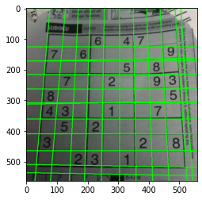
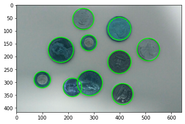
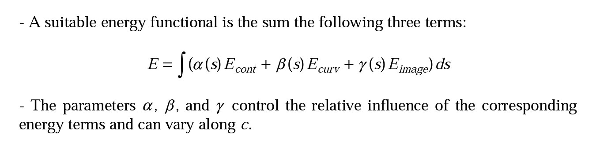
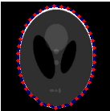
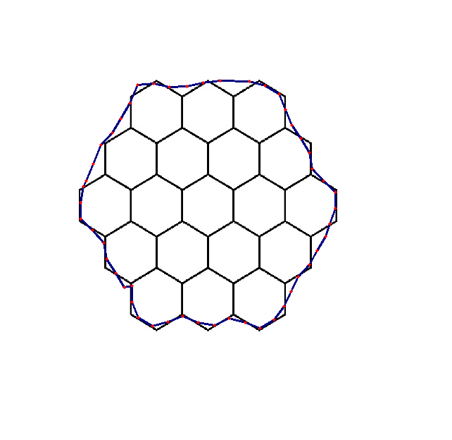

# SBE 404B - Computer Vision

## CV_Task 2

**Team 3**

**Submitted to: Dr. Ahmed Badwy and Eng. Mohamed Adel**

Submitted by:

|              Name              | Section | B.N. |
|:------------------------------:|:-------:|:----:|
|   Esraa Mohamed Saeed   |    1    |   10  |
|   Alaa Tarek Samir   |    1    |  12  |
| Amira Gamal Mohamed  |    1    |  15  |
|   Fatma Hussein Wageh   |    2    |  8  |
| Mariam Mohamed Osama |    2    |  26  |

**The programming langusage is Python**

### Task requirments

  #### We are asked to:
- Detect edges using Canny edge detector, detect lines, circles, ellipsed located in these images (if any). Superimpose the detected shapes on the images.
- Initialize the contour for a given object and evolve the Active
Contour Model (snake) using the greedy algorithm. Represent the output as chain code and compute the perimeter and the area inside these contours.

**Detecting Edges, Lines, and Circles**

- //illustrate and put results here

**Results**

**Active Contour (Snakes)**

- The active contour model, or snake, is defined as an energy minimizing spline.
- The snake's energy depends on its shape and location within the image.
- Snakes may be understood as a special case of a more general technique of matching a deformable model to an image by means of energy minimization.
- It must must specify an approximate shape and starting position for the snake somewhere near the desired contour.

**Greedy Algorithm**

- The greedy method is an implementation technique used to simplify the implementation of the minimization of energy without having to perform an optimization algorithm technique such as the gradient descent. It works under the assumption that finding for each point of the contour the closest local energy minimizing neighbor will converge to the overall global minimum of the contour.

*Note*: The set-up of the α, β and gamma coefficient does play an important role in the shape of the contour.

**Results**

- //put results here

